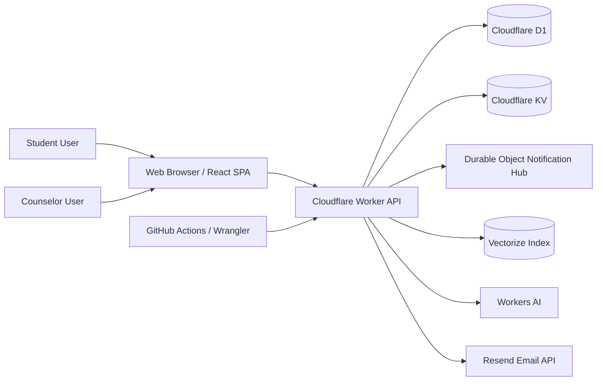
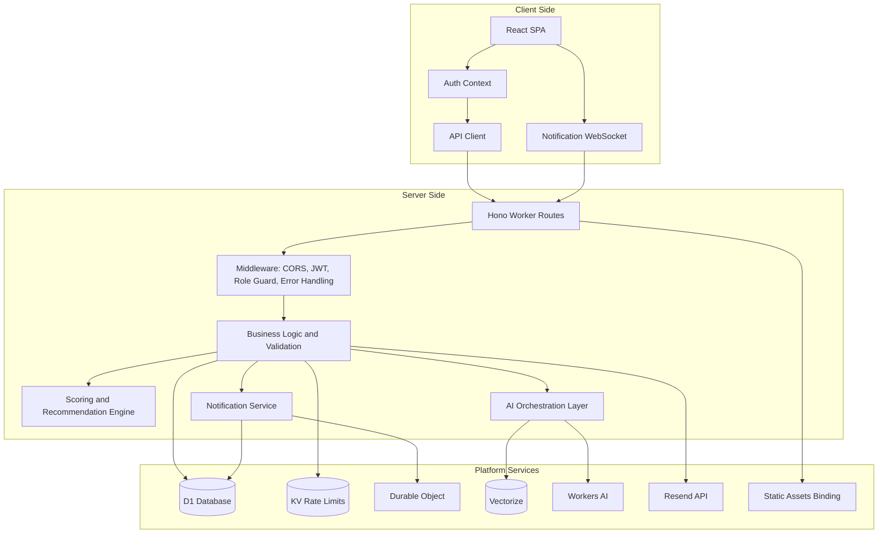
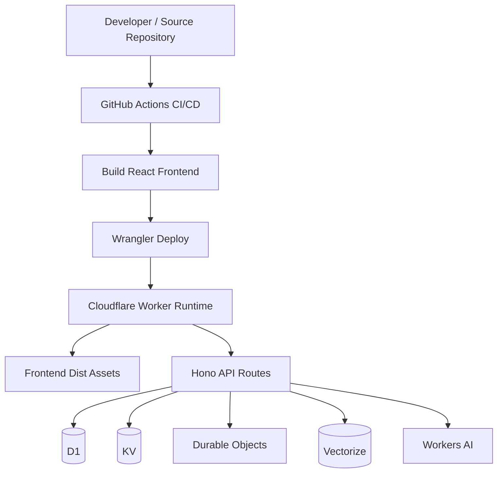
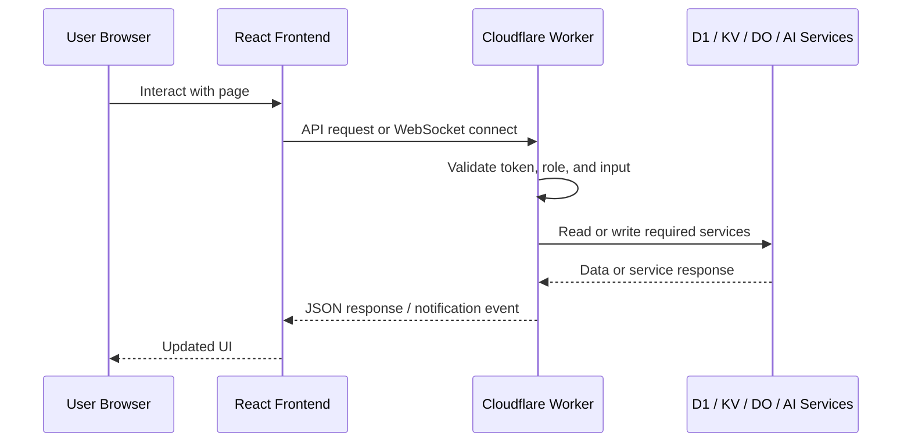
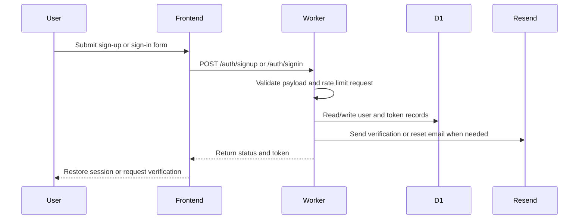
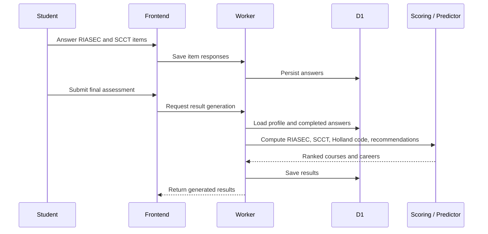
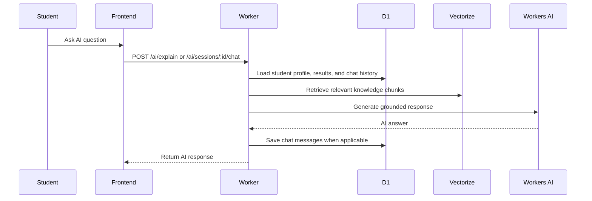
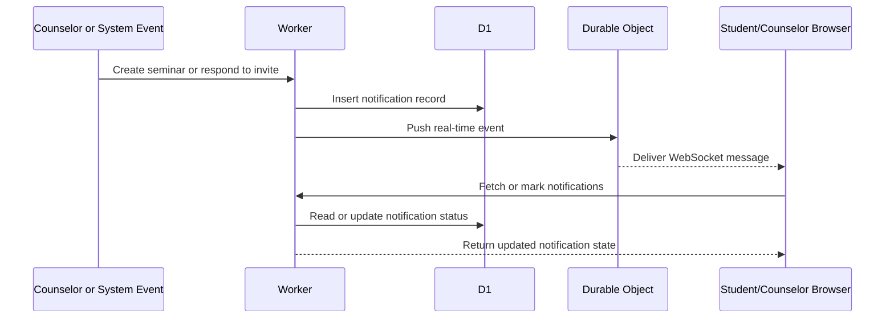
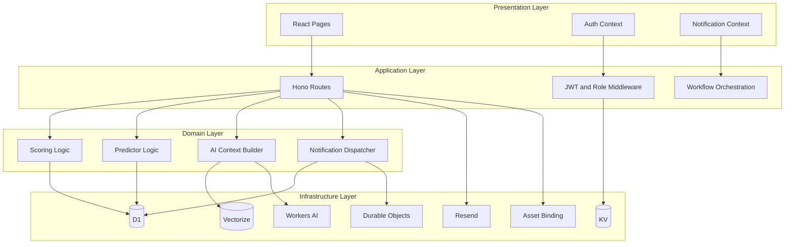

# CareerLinkAI System Architecture

## 1. Introduction

This document presents the system architecture of CareerLinkAI, a web-based career guidance platform for senior high school students and counselors. The architecture describes the high-level structure of the system, the major software and cloud components, the way data moves between them, and the interaction flow that supports the core functions of the platform.

CareerLinkAI is implemented as a cloud-native monorepo composed of a React frontend and a Cloudflare Worker backend. The backend integrates multiple managed services, including D1 for relational data, KV for rate limiting, Durable Objects for real-time notifications, and Workers AI with Vectorize for AI-assisted counseling and explanation features.

## 2. Architectural Style

CareerLinkAI follows a layered client-server architecture with serverless deployment characteristics.

The architecture combines:

1. A presentation layer implemented as a single-page application (SPA) for student and counselor users.
2. An application layer implemented inside a Cloudflare Worker using Hono routes and middleware.
3. A data layer composed of Cloudflare-managed persistence and communication services.
4. An AI support layer for retrieval-augmented generation, contextual explanations, and chat assistance.

This style was selected because it:

1. Separates user interface concerns from business logic and persistence.
2. Supports role-based workflows for students and counselors.
3. Simplifies deployment by hosting API logic and frontend assets under one worker-based runtime.
4. Enables horizontal scalability through stateless request processing.
5. Supports near real-time communication without maintaining a traditional always-on server.

## 3. High-Level System Overview

At a high level, the system has two main user-facing actors: students and counselors. Both interact through a web browser. Their requests are sent to the Cloudflare Worker API, which handles authentication, validation, business rules, data processing, recommendation generation, AI support, and notification delivery.

The Worker orchestrates the following backend services:

1. `D1` for transactional records such as users, profiles, departments, assessments, results, invitations, notifications, and AI chat sessions.
2. `KV` for rate limiting and abuse protection.
3. `Durable Objects` for WebSocket-based real-time notification sessions.
4. `Vectorize` for knowledge retrieval.
5. `Workers AI` for AI explanation, AI counselor chat, embeddings, and event draft assistance.
6. `Resend API` for verification and password reset emails.

## 4. System Context Diagram

## 5. Client-Server Architecture

### 5.1 Client Layer

The client side is implemented using React, Vite, TypeScript, TailwindCSS, and React Router. It is responsible for rendering the user interface and guiding users through role-specific workflows.

The frontend contains:

1. Public pages such as landing, sign-in, sign-up, email verification, and password reset.
2. Student pages such as profile basics, onboarding, RIASEC, SCCT, results, departments, activity, AI counselor, and settings.
3. Counselor pages such as dashboard, departments, department detail, analytics, activity, student detail, and settings.
4. Shared client modules for authentication state, API access, portal navigation, and notification handling.

The client stores the JWT token locally and uses it for authenticated API requests. It also establishes a WebSocket connection for real-time notifications after successful login.

### 5.2 Server Layer

The server side is implemented as a Cloudflare Worker using the Hono framework. The Worker acts as a unified API gateway and business logic processor.

Its main responsibilities are:

1. Handling HTTP requests from the frontend.
2. Enforcing authentication and role-based authorization.
3. Validating sign-up, sign-in, onboarding, assessment, and department workflows.
4. Computing RIASEC and SCCT scores.
5. Generating course and career recommendations using scoring and predictor logic.
6. Managing seminars, invitations, notifications, and activity logs.
7. Orchestrating AI explanation and chat workflows.
8. Serving static frontend assets for non-API routes.

### 5.3 Client-Server Block Diagram

## 6. Internal Architectural Components

### 6.1 Presentation Component

The presentation component is the React SPA under `apps/frontend`. It is responsible for:

1. Displaying forms, dashboards, charts, and recommendation views.
2. Routing users to the correct pages based on role and completion status.
3. Calling backend endpoints through a centralized API utility.
4. Restoring session state through `/auth/me`.
5. Listening for notification events through the WebSocket notification channel.

### 6.2 Application Component

The application component is the Worker under `apps/worker/src/index.ts`. It contains route groups for:

1. Health and operational endpoints.
2. Authentication and account lifecycle management.
3. Student profile, onboarding, and assessment operations.
4. Result generation and retrieval.
5. AI explanation and AI counselor chat.
6. Counselor department, seminar, analytics, and student monitoring features.
7. Student collaboration features such as joining departments and responding to seminar invitations.
8. Notification retrieval and WebSocket upgrade handling.

### 6.3 Domain Logic Component

The domain logic is implemented through modular files such as:

1. `auth.ts` for password hashing, token generation, verification, and join code generation.
2. `scoring.ts` for RIASEC and SCCT calculations.
3. `ml/predictor.ts` and predictor map logic for course and career recommendation matching.
4. `studentContext.ts` for assembling context used by AI features.
5. `rateLimit.ts` for abuse protection using KV.
6. `notificationDO.ts` for persistent WebSocket connection management.

### 6.4 Data Services Component

The data services support different system responsibilities:

1. `D1` stores structured and transactional records.
2. `KV` stores lightweight counters for rate limiting.
3. `Durable Objects` maintain user-specific live notification channels.
4. `Vectorize` stores and retrieves knowledge chunks for AI grounding.

### 6.5 Integration Component

External integrations are used only where necessary:

1. `Workers AI` performs embeddings and language generation.
2. `Resend` delivers verification and password reset emails.
3. `GitHub Actions` and `Wrangler` automate build and deployment.

## 7. Deployment Architecture

CareerLinkAI uses a unified deployment model. The frontend is built into static assets, and the Cloudflare Worker serves both the API and the frontend bundle. This reduces deployment complexity because only one logical service is published.

### 7.1 Deployment Diagram

### 7.2 Deployment Characteristics

The deployment model has the following characteristics:

1. The frontend production build is stored in `apps/frontend/dist`.
2. The Worker binds the asset directory through `ASSETS`.
3. API requests are handled by Hono routes inside the same worker.
4. Non-API routes fall back to `index.html`, enabling SPA routing.
5. Scheduled jobs trigger knowledge base seeding through cron.

## 8. Data Architecture

The data architecture is centered on relational persistence with supporting specialized services.

### 8.1 Core Transactional Data

The D1 database stores the primary records required by the application, including:

1. `users` and `profiles` for account and profile information.
2. `riasec_answers` and `scct_answers` for per-item assessment responses.
3. `results` for computed recommendations and score summaries.
4. `departments` and `department_members` for counselor-managed group membership.
5. `seminars` and `seminar_invites` for event coordination.
6. `activity` and `notifications` for system collaboration history.
7. `ai_chat_sessions` and `ai_chat_messages` for persistent AI conversations.
8. `password_reset_tokens`, `email_verification_tokens`, and `system_config` for operational flows.

### 8.2 Supporting Data Services

1. KV is used for rate-limiting counters because it is lightweight and appropriate for short-lived access control data.
2. Vectorize stores embedded knowledge documents for retrieval during AI requests.
3. Durable Objects hold active WebSocket sessions for real-time notification delivery.

### 8.3 Data Flow Principle

Transactional records are always written to D1 first. If a live signal is also needed, the Worker then forwards the notification to the Durable Object. This means persistent correctness does not depend on real-time delivery succeeding.

## 9. Request Processing Flow

The system processes requests through a consistent sequence:

1. The browser sends an HTTP or WebSocket request.
2. The Worker receives the request and applies middleware.
3. Authentication and role checks are performed when required.
4. Input validation and business rules are applied.
5. The Worker interacts with one or more backend services.
6. The response is returned as JSON for API routes or as assets for frontend navigation.

### 9.1 General Architecture Flow

## 10. Key Functional Architecture Flows

### 10.1 Authentication Flow

The authentication architecture ensures:

1. Passwords are hashed before storage.
2. JWT tokens are issued only after valid login.
3. Protected routes require token validation and role matching.
4. Email verification and password reset use one-time token records.

### 10.2 Assessment and Recommendation Flow

This flow allows the system to:

1. Autosave answers incrementally.
2. Validate completion before computing results.
3. Convert assessment and profile data into recommendation outputs.
4. Preserve results for later student and counselor access.

### 10.3 AI Explain and AI Counselor Flow

This AI architecture uses retrieval-augmented generation so that the response is grounded on the system knowledge base rather than relying only on a general-purpose model.

### 10.4 Notification Flow

The notification architecture separates:

1. Persistent notification storage in D1.
2. Live delivery through Durable Objects and WebSockets.
3. Read-state management through normal authenticated API endpoints.

## 11. Layered Architecture Summary

## 12. Architectural Strengths

The current architecture provides several advantages:

1. Clear separation of presentation, application, domain, and infrastructure responsibilities.
2. Simple deployment because the frontend and backend are served together.
3. Scalable request handling because the core HTTP processing is serverless and stateless.
4. Reliable collaboration workflows because data is persisted before real-time push is attempted.
5. Extensible AI support because knowledge retrieval, chat persistence, and model invocation are already modularized.
6. Strong alignment with role-based workflows for students and counselors.

## 13. Architectural Constraints and Tradeoffs

The architecture also introduces several tradeoffs:

1. A single Worker deployment simplifies operations but concentrates many concerns in one backend service.
2. KV-based rate limiting is suitable for abuse reduction, but not for strict quota accounting.
3. AI quality depends on the relevance and freshness of the Vectorize knowledge corpus.
4. Real-time notification delivery depends on active WebSocket sessions, although persistence remains safe in D1.
5. The web-based architecture avoids mobile app complexity, but it depends on stable internet connectivity.

## 14. Conclusion

CareerLinkAI uses a modern cloud-native system architecture built around a React SPA and a Cloudflare Worker backend. The architecture is designed to support secure role-based access, assessment processing, recommendation generation, AI-assisted counseling, real-time notifications, and manageable deployment in a single integrated platform.

From a system architecture perspective, the platform is well suited for the requirements of a thesis-scale but production-oriented web application because it balances modularity, scalability, operational simplicity, and support for advanced services such as AI and real-time communication.
